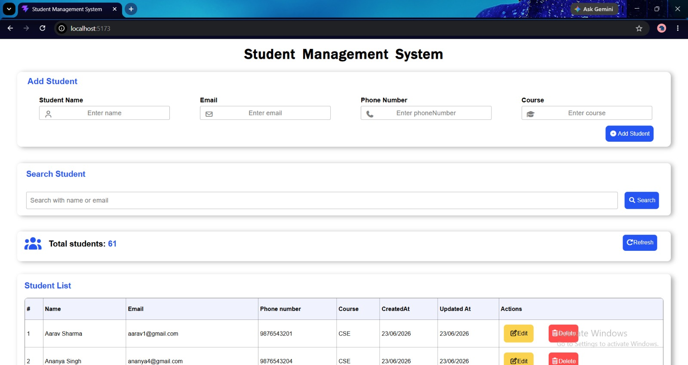
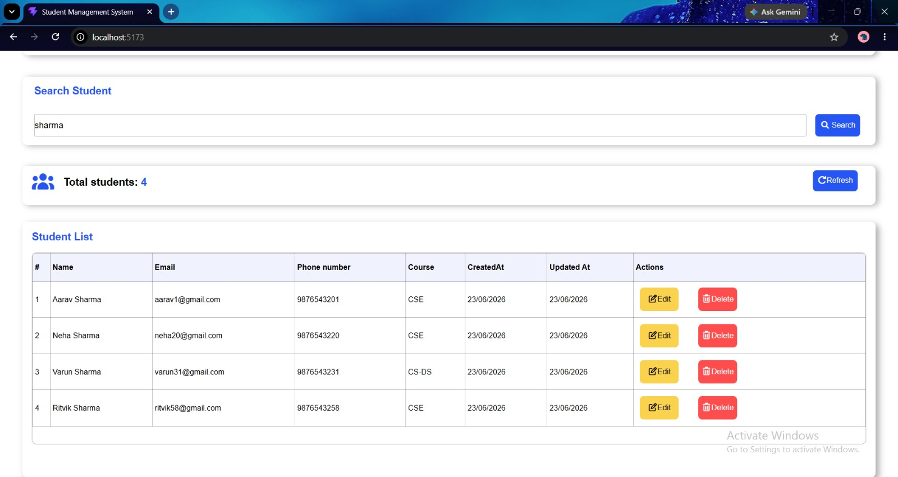
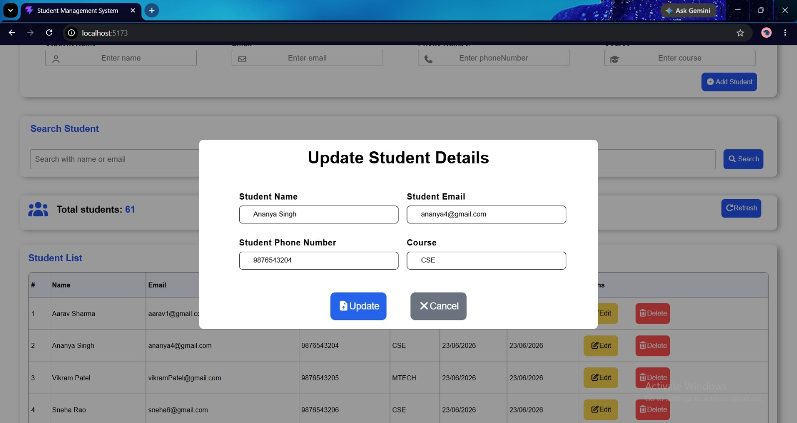
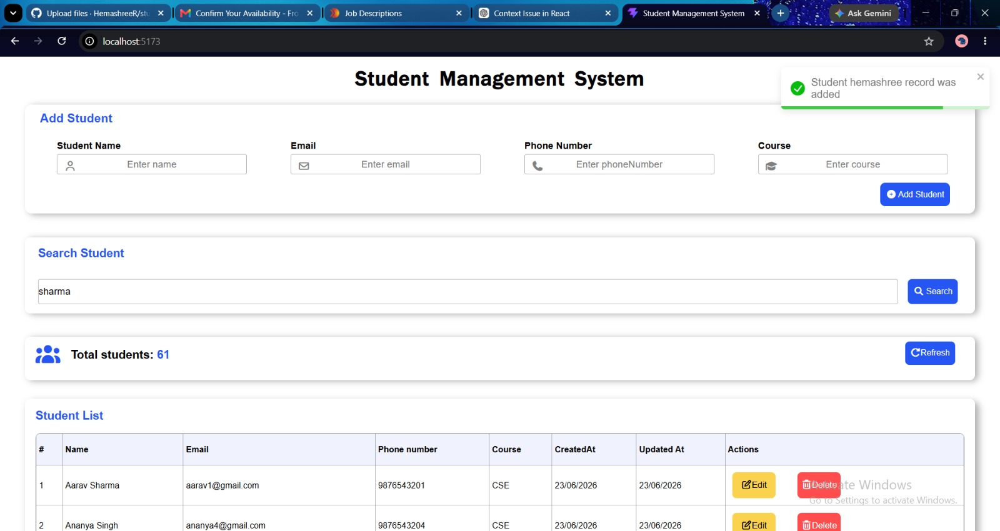

# Student Management System

A full-stack CRUD application built using React.js, Node.js, Express.js, and MongoDB.

## Features

* Add Student
* Update Student
* Delete Student
* Search Student by Name or Email
* Student Count
* Toast Notifications

## Tech Stack

* React.js
* Context API
* Axios
* Node.js
* Express.js
* MongoDB

## Screenshots

### Home Page

### Search Functionality

### Update Student Details

### Toast Notification

## Author

Hemashree R
